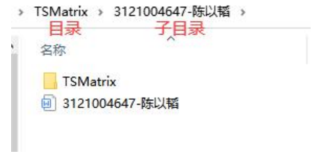

# 1.要求

## 1.1 实验目的 

实现**该抽象数据类型的全部基本操作**。

## 1.2 实验内容

二叉树（BTree）

## 1.3 实验步骤

- [x] 确定要实现的抽象数据类型，每班每题最多六人选择，10 月 10 日之前以班为单位进行反馈； 
- [ ] 选择存储结构，并写出相应的类型定义，在此基础上，对基本操作做适当的选取和增加； 
- [x] 设计各基本操作的实现算法，并表达为函数形式，实现语言为 C 语言，运行环境不限，但建 议使用 Visual Studio；
- [ ] 设计测试方案，编写主函数； 
- [ ] 将 2-4 步的结果写成报告。

## 1.4 提交资料与时间

1.提交的资料，包括： 

1）打印报告：双面打印，以“学号-姓名”格式进行命名，比如 3121004647-陈以韬； 

2）源码：提交工程文件，该工程文件以所选抽象数据类型的英语名进行命名，比如若选择稀疏 矩阵，工程文件命名为 TSMatrix，在程序运行界面突出显示班级、学号、姓名和完成时间。 

2.提交时间：最后一次课（即 11 月 11 日），以班为单位提交打印报告和一张光盘。其中光盘 中，一题一个目录，一个学生一个子目录，格式同下图：

## 1.5 考核形式和评分标准

1）内容（50%）：

所实现的抽象数据类型应该全部符合要求，存储结构和各基本操作的实 现清晰合理；

数量+质量，存储结构（优先常用的存储结构，多个存储结构—>多个文件（.h 和.cpp）， 二叉树、树和图不建议使用书本常用存储结构）+各基本操作（优先重要和合理的基本操作）； 

2）测试（20%）：测试正确、完备、方便（串行测试不建议，交互界面 switch-case/scanf/getchar）、 清晰（增加必要的打印函数和交互界面友好）； 

3）报告（30%）：格式工整，叙述清楚。 

如果有下列情况，则视情节严重程度，成绩下降若干档次，直至不及格： 

 工程文件的内容不能正确读出； 

 抄袭、复制别人程序或文档； 

 未能按时提交报告和代码。

# 2.日志

因为二叉树不推荐使用书本常用存储结构，所以**使用顺序存储结构**。

 二叉树的顺序存储，就是用一组连续的存储单元存放二叉树中的结点。因此，必须把二叉树的所有结点安排成为一个恰当的序列，结点在这个序列中的相互位置能反映出结点之间的逻辑关系，用编号的方法从树根起，自上层至下层，每层自左至右地给所有结点编号,缺点是有可能对存储空间造成极大的浪费，在最坏的情况下，一个深度为k且只有k个结点的右单支树需要2k-1个结点存储空间。依据二叉树的性质，完全二叉树和满二叉树采用顺序存储比较合适，树中结点的序号可以唯一地反映出结点之间的逻辑关系，这样既能够最大可能地节省存储空间，又可以利用数组元素的下标值确定结点在二叉树中的位置，以及结点之间的关系。

对于一般的二叉树，如果仍按从上至下和从左到右的顺序将树中的结点顺序存储在一维数组中，则数组元素下标之间的关系不能够反映二叉树中结点之间的逻辑关系，只有**增添一些并不存在的空结点**，使之成为一棵完全二叉树的形式，然后再用一维数组顺序存储。如图5-6给出了一棵一般二叉树改造后的完全二叉树形态和其顺序存储状态示意图。显然，这种存储对于需增加许多空结点才能将一棵二叉树改造成为一棵完全二叉树的存储时，会造成空间的大量浪费，不宜用顺序存储结构。最坏的情况是右单支树，如图5-7 所示，一棵深度为k的右单支树，只有k个结点，却需分配2k－1个存储单元。